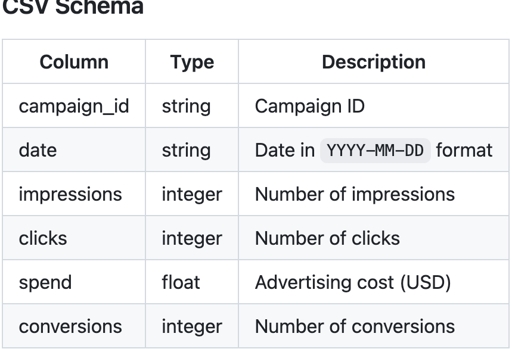
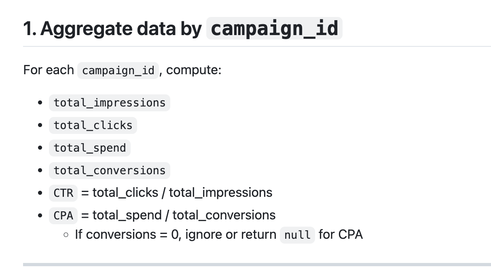
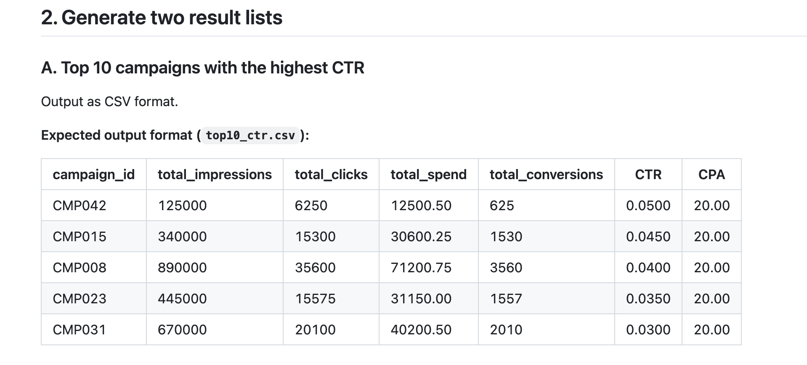
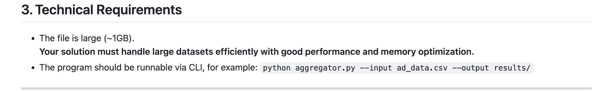

tôi cần dựng một ứng dụng CLI bằng java, trong đó, sẽ nhập một file csv nặng khoảng 1gb, có cấu trúc dữ liệu như ảnh đầu tiên tôi gửi. với mỗi campaign_id, tôi cần tính toán total_impressions, total_clicks, total_spend, total_conversions, CTR = total_clicks / total_impressions, CPA = total_spend / total_conversionsIf conversions = 0, ignore or return null for CPA. Ngoài ra, tôi cần xuất 2 file với file đầu tiên là top10_cpa.csv: top 10 campaign có CTR cao nhất và top10_cpa.csv: top 10 campaigns có CPA thấp nhất.

Giải pháp cần tối ưu về thời gian chạy, memory usage, hiệu suất phải tốt - do input data lớn ~ 1gb. Chương trình phải được chạy bằng CLI, ví dụ: python aggregator.py --input ad_data.csv --output results/

ngoài ra, tôi cần bạn in ra cli thống kê 2 chỉ số là thời gian chạy và memory usage khi chạy chương trình

giải thích một số logic trong code