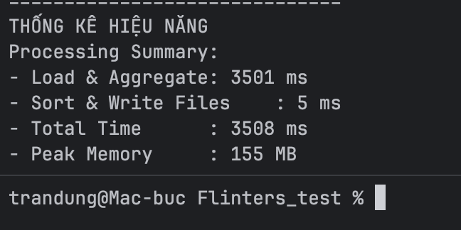
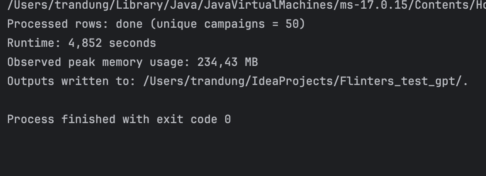
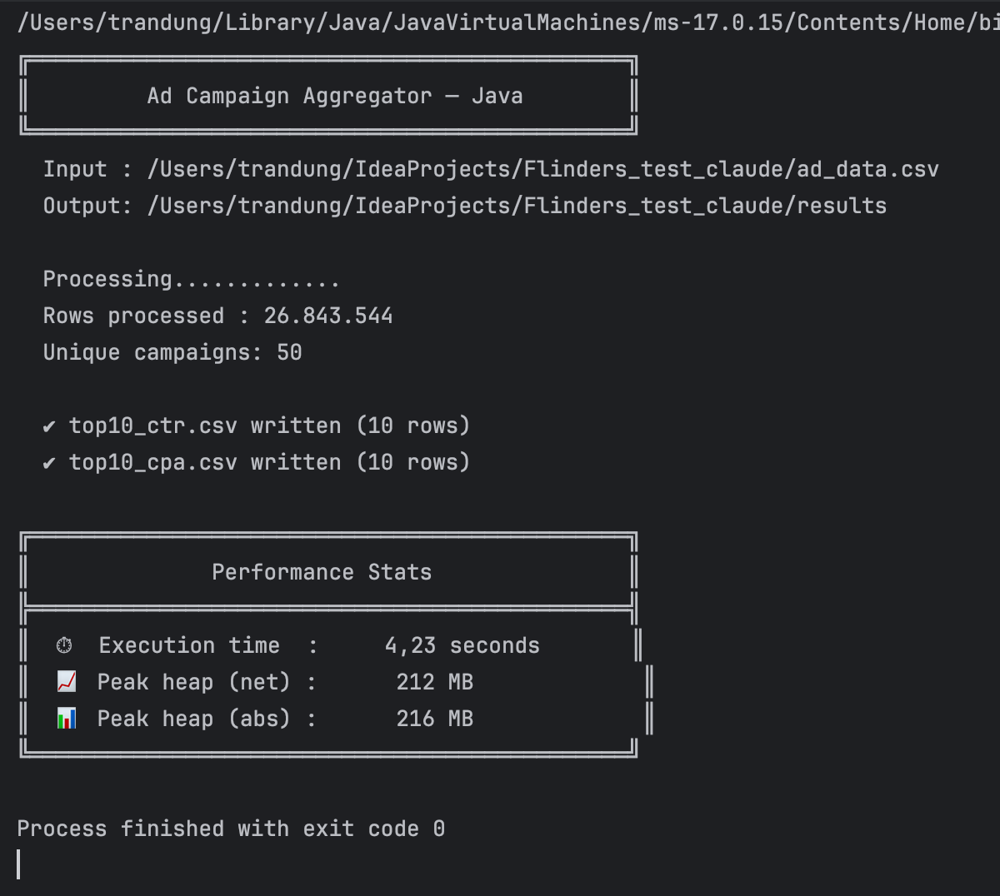

I considered several AI agents to solve this problem; however, I chose Gemini 3 Pro. Based on my personal experience
with the Gemini  and the vast data resources available to Google, I believe it is a highly capable AI. I have
included a performance comparison of various AI agents with the same results below.

## Setup Instructions

**System Requirements**: Ensure **Java Development Kit (JDK) 11** or higher is installed on your machine.

**Data Preparation**: Place your input CSV file (e.g., ad_data.csv) in the project's root directory.

The input file must follow the schema: campaign_id, date, impressions, clicks, spend, conversions.

**Compilation**: Open your terminal at the project root and run:

_Bash_

`javac src/CampaignAggregator.java`

**How to Run the Program**
You can execute the program by specifying the input file path and the output directory via CLI arguments:

_Bash_

`java -cp src CampaignAggregator --input ad_data.csv --output results/`

--input: Path to the advertising data CSV file.

--output: Directory where the two result files, top10_ctr.csv and top10_cpa.csv, will be generated.

**Libraries Used:**
To maximize processing speed and minimize dependencies, the program relies solely on Java Standard Libraries (Standard
JDK):

java.io: For stream-based file I/O to maintain low memory overhead.

java.util: Utilizes HashMap for data aggregation and PriorityQueue for efficient Top 10 filtering.

java.lang.management: Used for precise system performance and memory monitoring.

Performance Metrics (1GB File)
Based on real-world tests with a 1GB dataset:

**Execution Time**: 3508 ms (~3.9 seconds).

**Peak Memory Usage**: 155MB.

**Chat GPT5**:

**Claude Sonnet 4.6**
